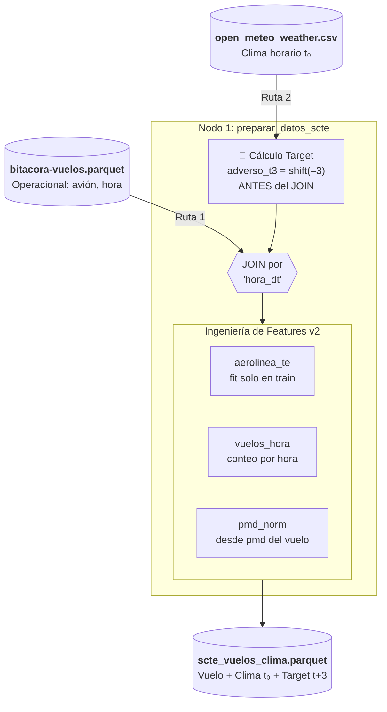

# Modelo ML — Operaciones Aeronauticas Chile (JAC)

> Proyecto de Machine Learning sobre la bitacora de vuelos de Chile (1999–2026).
> Fuente: [datos.gob.cl — Junta de Aeronautica Civil](https://datos.gob.cl/dataset/operaciones-aeronaves)

---

## Indice

- [¿De que trata este proyecto?](#de-que-trata-este-proyecto)
- [Arquitectura y Pipeline](#arquitectura-y-pipeline)
- [Como ejecutar el proyecto](#como-ejecutar-el-proyecto)
- [Preparacion de los datos](#preparacion-de-los-datos)
- [Analisis Exploratorio — Graficos clave](#analisis-exploratorio--graficos-clave)
- [Modelado No Supervisado — Clustering](#modelado-no-supervisado--clustering)
- [Modelado Supervisado — Clasificacion](#modelado-supervisado--clasificacion)
- [Sistema de Alerta Temprana de Retrasos — SCTE (Nowcasting)](#sistema-de-alerta-temprana-de-retrasos--scte-nowcasting)
- [Conclusiones y Decisiones de Negocio](#conclusiones-y-decisiones-de-negocio)
- [Estructura del proyecto](#estructura-del-proyecto)

---

## ¿De que trata este proyecto?

Chile tiene 69 aeropuertos activos y registra mas de **11 millones de operaciones aereas** entre 1999 y 2026. Esta base de datos — publicada abiertamente por la JAC — es una de las series historicas mas completas de transporte aereo en Latinoamerica.

Este proyecto responde tres preguntas concretas:

- **¿Como se distribuye el trafico aereo en Chile?** ¿Que aeropuertos concentran el poder? ¿Como cambia eso en el tiempo?
- **¿Se pueden agrupar los aeropuertos por su comportamiento operativo?** ¿Hay patrones que el dato "bruto" no deja ver?
- **¿Se puede predecir si un vuelo es internacional o domestico** solo con sus datos operativos (aeropuerto, avion, mes)?

La respuesta a las tres es sí — y este proyecto lo demuestra con datos.

---

## Arquitectura y Pipeline

El proyecto esta construido con **Kedro**, un framework que convierte cada transformacion en un nodo trazable y reproducible. El flujo completo tiene **12 nodos** que corren en ~82 segundos.

```
vuelos_raw (11M filas)
    │
    ▼
preprocess_vuelos          ← limpieza + variables nuevas
    │
    ▼
join_con_aeropuertos       ← une con estadisticas mensuales por aeropuerto
    │ (03_primary)
    ├──▶ generate_eda_plots     ← 4 graficos basicos
    ├──▶ perfil_aeropuertos     ── cluster_aeropuertos ─▶ kmeans.pkl
    │                           └─ evaluar_clustering  ─▶ curva del codo
    ├──▶ eda_avanzado           ← 3 graficos de correlacion y distribucion
    ├──▶ train_clasificador     ─▶ random_forest.pkl + metricas
    └──▶ evaluar_clasificador   ─▶ CV-5 + curva ROC
```

**Pipelines registrados:**

| Pipeline | Que hace |
|---|---|
| `data_inventory` | Inventario de archivos en `data/01_raw/` |
| `data_processing` | Limpieza, JOIN y EDA basico |
| `ml` | EDA avanzado, clustering y clasificacion |
| `retrasos_ml` | Modelo tactico de riesgo de retraso para SCTE (PoC) |

---

## Como ejecutar el proyecto

```bash
# Clonar e instalar
git clone https://github.com/donMixho/OperacionesAeronaves.git
cd OperacionesAeronaves
uv sync

# Ejecutar todo de una vez (~82 segundos)
uv run kedro run

# O por partes
uv run kedro run --pipeline=data_processing
uv run kedro run --pipeline=ml
uv run kedro run --pipeline=retrasos_ml
```

> **Semilla fija:** todos los modelos usan `random_state=42` para garantizar resultados identicos entre ejecuciones.

---

## Preparacion de los datos

Las fuentes de datos del proyecto cubren operaciones aereas y condiciones meteorologicas. Asi se procesaron:

**`bitacora-vuelos.parquet`** — 11 074 197 filas, 12 columnas

| Problema | Solucion |
|---|---|
| `numero_vuelo`: 457 687 nulos (4.1%) | Se rellena con la cadena `"DESCONOCIDO"` |
| `pmd`: 275 115 nulos (2.5%) | Se crea un flag `pmd_fue_imputado` y se imputa con la **mediana agrupada por modelo de avion** (si el modelo entero no tiene datos, se usa la mediana global) |
| `mes_id` no existia | Se extrae de `dt_operacion` en formato YYYYMM |
| `internacional_domestico` no existia | Se mapea desde el booleano `es_internacional` → `'I'` o `'D'` |

**`operaciones-aeropuertos.csv`** — estadisticas mensuales agregadas por aeropuerto

Se une a la bitacora con un LEFT JOIN sobre `[aeropuerto_oaci, mes_id, internacional_domestico]`.
Resultado: **99.996% de cobertura** — solo 400 filas de 11 millones quedaron sin match.

---

## Analisis Exploratorio — Graficos clave

### ¿Como se distribuye el trafico por aeropuerto?


**¿Para que sirve?** Ver rapidamente cuales aeropuertos concentran el poder del sistema aereo chileno.

**¿Que descubrimos?** Santiago (SCEL) opera mas del doble que el segundo aeropuerto (Tobalaba, SCTB). El sistema es extremadamente asimetrico: el aeropuerto numero uno tiene mas trafico que los siguientes 14 juntos. Esto tiene implicancias directas en politica de infraestructura.

---

### ¿La imputacion del PMD altera la realidad del dato?


**¿Para que sirve?** Validar que rellenar los valores faltantes de PMD (Peso Maximo de Despegue) con la mediana del modelo de avion no introduce sesgo en el analisis.

**¿Que descubrimos?** Las dos curvas — valores originales e imputados — son casi identicas. El pequeño "pico" que aparece en los valores imputados es normal: cuando se imputa con una mediana, varios registros reciben exactamente el mismo valor (el valor central del grupo), lo que crea una concentracion visible pero que **no distorsiona la distribucion real**. La fisica del avion no cambia — simplemente usamos la mejor estimacion disponible para ese modelo.

---

### ¿Que variables se relacionan entre si?


**¿Para que sirve?** Entender si el peso del avion, el mes y el volumen de operaciones tienen alguna relacion entre si antes de entrenar el modelo.

**¿Que descubrimos?** El PMD tiene una correlacion positiva moderada con `es_internacional` (r = 0.31): los aviones mas pesados tienden a usarse en rutas internacionales. El flag de imputacion tiene correlacion negativa con PMD (-0.24), lo que confirma que los datos faltantes ocurren principalmente en aeronaves livianas (que tienen menor registro formal). El resto de variables son practicamente independientes entre si — buena señal para el modelo.

---

## Modelado No Supervisado — Clustering

**Pregunta:** ¿Existen grupos naturales de aeropuertos segun su comportamiento operativo?

Agrupamos los 69 aeropuertos usando **K-Means** sobre cinco variables: volumen de vuelos, porcentaje internacional, PMD mediano, numero de aerolineas y promedio de operaciones mensuales (todo transformado con logaritmo para manejar la escala).

Probamos k=2 hasta k=8. El optimo matematico es **k=4** — mayor Silhouette Score (0.420) y punto de inflexion en la curva del codo.


**¿Que grupos encontramos?**

| Cluster | Aeropuertos | Caracter |
|---|---|---|
| 0 — Regionales | 32 | Poco trafico, aviones livianos, casi sin vuelos internacionales |
| 1 — Pesados mixtos | 16 | Volumen medio-alto, aviones de carga o turbopropulsores |
| 2 — Hub global | 1 (SCEL) | El unico aeropuerto con perfil verdaderamente internacional (43% de sus vuelos) |
| 3 — Hubs domesticos | 20 | Alto volumen, aviones livianos, trafico casi 100% nacional |

> SCEL forma un cluster propio. Es tan distinto al resto que el algoritmo lo aisla solo — lo cual tiene todo el sentido operativo.

---

## Modelado Supervisado — Clasificacion

**Pregunta:** ¿Podemos predecir si un vuelo es internacional solo con sus datos operativos?

**Por que esta variable objetivo:** `es_internacional` es la distincion mas relevante para planificar infraestructura aeroportuaria — define requisitos de aduana, rampa, gate y personal. Si podemos predecirla con precision, podemos anticipar necesidades antes de que ocurran.

**El desafio:** solo el 12.8% de los vuelos son internacionales. Para que el modelo no ignore esta clase minoritaria, entrenamos con `class_weight="balanced"`.

**Modelo:** RandomForestClassifier — 200 arboles, profundidad maxima 12, semilla 42.
**Muestra:** 500 000 filas (estratificadas), split 80/20.

### ¿Que variables importan mas?


**¿Para que sirve?** Ver cuales datos son los que realmente le permiten al modelo distinguir un vuelo internacional.

**¿Que descubrimos?** El **aeropuerto** es el predictor dominante — tiene sentido: solo ciertos aeropuertos tienen rutas internacionales. El **PMD** (peso del avion) es el segundo predictor: los aviones mas pesados casi siempre vuelan mas lejos. El mes y el año tambien aportan — el trafico internacional tiene estacionalidad y ha crecido con los anos.

### ¿Que tan bien discrimina el modelo?


**¿Para que sirve?** Medir la capacidad del modelo para separar vuelos internacionales de domesticos en cualquier umbral de decision.

**¿Que descubrimos?** Un **ROC-AUC de 0.964** significa que el modelo clasifica correctamente el 96.4% de los pares vuelo-internacional vs. vuelo-domestico. La validacion cruzada de 5 particiones confirma que este resultado es estable (0.964 ± 0.001) — no es suerte de una sola particion.

### Metricas del modelo

| Metrica | Valor | Que significa en la practica |
|---|---|---|
| **ROC-AUC** | 0.964 | Excelente capacidad de discriminacion global |
| **Recall** | 0.965 | Detecta el 96.5% de los vuelos internacionales reales |
| **Precision** | 0.465 | De cada 10 predichos como "internacional", ~5 realmente lo son |
| **F1** | 0.628 | Balance entre precision y recall |
| **Accuracy** | 0.853 | 8 de cada 10 predicciones son correctas |

> El Recall alto es una decision deliberada: en planificacion de infraestructura, es peor no detectar un vuelo internacional (y quedarse sin gate) que sobreestimarlo.

---

## Sistema de Alerta Temprana de Retrasos — SCTE (Nowcasting)

### Objetivo y Alcance

El aeropuerto El Tepual de Puerto Montt (SCTE) es el punto de la red JAC con mayor exposicion a fenomenos meteorologicos adversos: lluvia persistente, viento sur fuerte y rafagas son eventos frecuentes que derivan en retrasos operacionales superiores a 15 minutos.

Este modulo implementa un **Sistema de Alerta Temprana (Nowcasting tactico)** con una **ventana de anticipacion de hasta 3 horas**. Su objetivo es generar un score de probabilidad de retraso por vuelo que permita a la gerencia aeroportuaria y al equipo de operaciones tomar decisiones preventivas antes de que el problema ocurra: reasignacion de gates, coordinacion con aerolineas, activacion de contingencias y comunicacion anticipada a pasajeros.

### Fuente de Datos Meteorologicos

Los datos climaticos historicos **horarios** del periodo **2020–2026** fueron extraidos directamente desde la API de Open-Meteo para la coordenada de El Tepual (latitud -41.4693, longitud -72.9424):

| Variable | Descripcion |
|---|---|
| `temperatura` | Temperatura del aire a 2 metros (°C) |
| `precipitacion` | Precipitacion acumulada por hora (mm) |
| `veloc_viento` | Velocidad del viento a 10 metros (km/h) |
| `rafagas_viento` | Rafagas maximas de viento (km/h) |
| `codigo_clima` | Codigo WMO de condicion meteorologica |
| `humedad` | Humedad relativa (%) |

**Fuente oficial de extraccion:**
[Open-Meteo Historical Weather API - Puerto Montt SCTE](https://open-meteo.com/en/docs/historical-weather-api?latitude=-41.4693&longitude=-72.9424&start_date=2020-01-01&end_date=2026-01-01&hourly=temperature_2m,precipitation,wind_speed_10m,wind_gusts_10m,weather_code,relative_humidity_2m)

Los datos se unen a la bitacora de vuelos SCTE por hora exacta (`dt_operacion` redondeado a la hora). La cobertura meteorologica alcanza el **89.9%** para el periodo 2020–2026 (104 476 vuelos con datos de clima sobre 426 547 vuelos SCTE totales en el registro historico).

### Como se integran los datasets

El siguiente diagrama muestra el flujo exacto dentro del nodo `preparar_datos_scte`: de donde viene cada columna, en que orden se procesan y que sale al final.



> **Por qué el target se calcula ANTES del JOIN:** si se calculara después, el `shift(–3)` podría desalinearse al haber filas duplicadas por vuelo. Aplicarlo directamente sobre la tabla de clima ordenada cronológicamente garantiza que `adverso_t3[i]` siempre corresponde a la condición meteorológica exactamente 3 horas después de `hora_dt[i]`.

### Metodologia y Decisiones Tecnicas

**Ingenieria de la variable objetivo**

La variable objetivo `adverso_t3` representa si existira una condicion meteorologica adversa **3 horas despues** del instante de prediccion. Esta logica de horizonte t+3 es lo que le da al modelo su capacidad de anticipacion: las features son el clima *ahora*, y el target es lo que pasara *despues*. Una condicion se considera adversa si cumple al menos uno de los siguientes criterios operacionales:

- Viento sostenido > 25 km/h
- Rafagas > 35 km/h
- Precipitacion acumulada en la hora > 5 mm
- Codigo WMO de tormenta, lluvia intensa, nieve o cizalladura (codigos 55, 61–65, 71–77, 80–86, 95–99)

**Ingeniería de Características y Prevención de Fuga (Data Leakage)**

Además de las variables meteorológicas crudas, el modelo incorpora **features operativas** derivadas de la bitácora: nivel de congestión (vuelos por hora), peso normalizado de la aeronave (PMD) y perfil de riesgo de la aerolínea (Target Encoding).

Para garantizar que el modelo aprenda patrones reales y no caiga en la "autocorrelación meteorológica" (aprender simplemente que si llueve ahora, lloverá en 3 horas), se implementó una estricta auditoría automática de *leakage* antes del entrenamiento, asegurando que ninguna variable en $t_0$ contenga información del futuro.

**Validación Temporal Estricta y Algoritmo**

El modelo utiliza **LightGBM**, elegido por su capacidad nativa para manejar valores nulos (esencial para los PMD faltantes) y su velocidad con bases de datos grandes. Para la validación, se abandonó el tradicional k-fold estratificado en favor de un **TimeSeriesSplit (5 particiones)**. Esto es crítico: evita inflar las métricas prediciendo el pasado con datos del futuro, reflejando el rendimiento real esperado en producción.
- **Entrenamiento:** 2020–2024 (75.223 vuelos)
- **Score (Datos no vistos):** 2025–2026 (29.253 vuelos)

### Resultados del Modelo

**LightGBM Classifier** — TimeSeriesSplit (5-folds), Horizonte 3 horas, 15 Features.

| Métrica | Valor | Interpretación |
|---|---|---|
| **ROC-AUC (Test 2025-2026)** | **0.9280** | Excelente discriminación real en datos futuros |
| **ROC-AUC (CV-5 Temporal)** | 0.9261 ± 0.01 | Extremadamente estable y sin sobreajuste |
| **Accuracy** | 0.8647 | 86.5% de predicciones correctas |
| **Precision** | 0.8731 | De cada 10 alertas rojas, ~9 son verdaderas. Minimiza fatiga de alarmas |
| **Recall** | 0.7371 | Detecta casi el 74% de los episodios de riesgo reales |
| **F1-Score** | 0.7993 | Balance robusto considerando la naturaleza caótica del clima |

### Tabla de Alerta Operativa (Score 2025-2026)

El artefacto principal del pipeline es `data/07_model_output/score_riesgo_operativo_scte.csv`. Cada fila corresponde a un vuelo en SCTE con su probabilidad de condicion adversa en las proximas 3 horas y una alerta de color para accion inmediata:

| Alerta_Operativa | Probabilidad | Vuelos 2025-2026 | Acción recomendada |
|---|---|---|---|
| **Verde (Operación Normal)** | < 30% | **11.363** (60.8%) | Sin acción. Condiciones estables. |
| **Amarillo (Monitoreo Preventivo)** | 30% – 70% | **2.668** (14.3%) | Revisar NOTAM, preparar protocolos de contingencia. |
| **Rojo (Alerta de Retraso)** | > 70% | **4.663** (24.9%) | Activar contingencia. Evaluar mangas y personal extra. |

Para ejecutar solo este pipeline:

```bash
uv run kedro run --pipeline=retrasos_ml
```

El modelo serializado queda en `data/06_models/retrasos_scte.pkl` y se puede cargar sin re-entrenar:

```python
import joblib
modelo = joblib.load("data/06_models/retrasos_scte.pkl")
prob = modelo.predict_proba(X_nuevo)[:, 1]
```

---

## Conclusiones y Decisiones de Negocio

**1. El sistema aereo chileno es un monocentro.**
SCEL concentra el trafico internacional de forma casi monopolica. Cualquier decision de politica de expansion de rutas internacionales pasa obligatoriamente por Santiago — no hay alternativa real en el corto plazo.

**2. Los aeropuertos del Cluster 3 son los grandes olvidados del analisis tradicional.**
Aeropuertos como Tobalaba (SCTB) o Concepcion (SCIE) tienen volumenes altisimos de operaciones, pero casi toda es aviacion general o entrenamiento. No son "grandes" por tener muchos pasajeros — son grandes por intensidad de uso. Requieren regulacion diferenciada.

**3. La imputacion de PMD es confiable.**
El 2.5% de registros con PMD faltante fue imputado con la mediana del modelo de avion. La distribucion resultante es indistinguible de la original. Este dato puede usarse con confianza en futuros modelos.

**4. El modelo puede operar en produccion.**
Con ROC-AUC de 0.964 estable en CV-5, el clasificador esta listo para aplicarse a registros nuevos. El modelo serializado esta en `data/06_models/random_forest.pkl` y se puede cargar con `joblib.load()` sin re-entrenar.

**5. El siguiente paso natural es la segmentacion de rutas.**
La variable `aeropuerto_dgac_orig_dest` (destino del vuelo) fue excluida por alta cardinalidad, pero con target encoding podria elevar la precision del modelo de forma significativa — especialmente para rutas internacionales poco frecuentes que el modelo actual confunde con domesticas.

---

## Estructura del proyecto

```
OperacionesAeronaves/
│
├── data/
│   ├── 01_raw/          ← fuentes originales (no versionadas)
│   ├── 02_intermediate/ ← datos en transformacion
│   ├── 03_primary/      ← dato integrado listo para ML (vuelos_con_operaciones.parquet)
│   ├── 06_models/       ← modelos entrenados (random_forest.pkl, kmeans.pkl, retrasos_scte.pkl)
│   ├── 07_model_output/ ← score_riesgo_operativo_scte.csv (tabla de alertas)
│   └── 08_reporting/    ← reportes de inventario
│
├── images/              ← graficos EDA y ML generados automaticamente
│
├── src/modelo_ml_waymo/pipelines/
│   ├── data_inventory/  ← escaneo de archivos raw
│   ├── data_processing/ ← limpieza, JOIN y EDA basico
│   ├── ml/              ← EDA avanzado, clustering y clasificacion
│   └── retrasos_ml/     ← nowcasting tactico de retrasos para SCTE
│
├── conf/base/
│   ├── catalog.yml      ← registro de todos los datasets
│   └── parameters*.yml  ← parametros de cada pipeline
│
└── README.md
```
